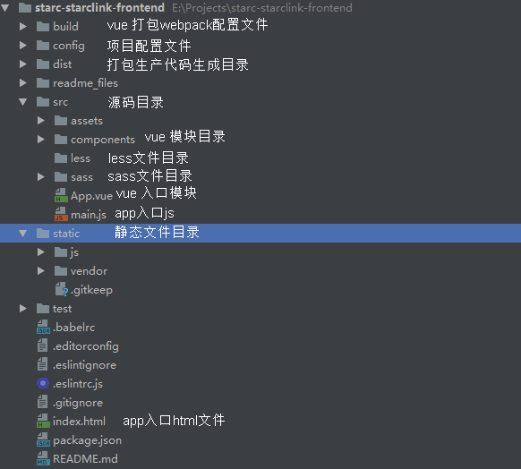

  # 学习大数据 pc前端业务

> 基于 Vue.js （项目主体结构使用 [vue-cli](https://github.com/vuejs/vue-cli) 生成）

## 环境要求

- 安装 nodejs v6.9.1+

## 开发构建

- 安装依赖
  
    运行 start-npm-install.bat
    
    运行 mock_server/start-npm-install.bat

- 开启开发服务器 serve with hot reload at localhost:8080
  
    `npm run dev` 或者 运行 

- 打包正式版
  
    运行run-build.bat
  
- 打包正式版（开启watch）
  
    运行run-build-watch.bat

- 运行单元测试
  
    npm run unit

- 运行 e2e 测试
  
    npm run e2e

- 运行 all 测试
  
    npm test
	  

## 项目现有模块，每个模块作为一个单页应用


  
  

  
## 项目架构参考文档

- [webpack](http://vuejs-templates.github.io/webpack/)

- [vue-loader](http://vuejs.github.io/vue-loader)


- 架构预览

    

## 相关文档
- [lib-flexible] 淘宝弹性布局方案lib-flexible实践

- [vux ui](https://vux.li) vue ui组件库

- [echarts](http://echarts.baidu.com/examples.html) 百度图表库

- [后端api文档](http://gitlab.pre.starclink.com/bigdata/front-end-api) 
  
- [vue 2.0](https://cn.vuejs.org/v2/guide/) mvvm框架

- [vue router](https://router.vuejs.org/zh-cn/) spa路由管理

- [vuex](https://vuex.vuejs.org/zh-cn/) flux状态管理
  
- [axios](https://www.awesomes.cn/repo/mzabriskie/axios) ajax

- [mockjs](https://github.com/nuysoft/Mock/wiki/Syntax-Specification) api模拟（json数值生成）
 
- [lodash](https://lodash.com/docs/) 数据结构工具类库

- [mathjax](https://www.mathjax.org/) 公式代码解析库

- [vue-filter](https://github.com/wy-ei/vue-filter#date) vue 常用过滤器

- [store](https://www.npmjs.com/package/store) localStorage Store


- [axios](readme_files/axios.md) 使用说明
- [vuex](readme_files/vuex.md) 配置，动态注册模块说明
- [图片预览 PhotoSwipe 组件](readme_files/preview.md) 说明

## 相关下载
  - [vuejs-devtools](https://chrome.google.com/webstore/detail/vuejs-devtools/nhdogjmejiglipccpnnnanhbledajbpd)

## 一些约定

  - 常规
  
    - 所有vue组件实例方法中，vm实例所对应的this 必须赋值给变量后使用，如：`let vm = this` 
  
    - 特殊单词的中英文对应关系，需要放在 [keys.md](keys.md) 中声明一下
    
  - 文件命名
  
    - .vue文件 使用首字母大写的驼峰命名，特殊文件如404，routes等，使用带下划线的小写 如 _404.vue,_routes.vue
    
    - 通用文件夹名称如 common utils 等，需要使用 _ 前缀，如 _common,_utils
    
    - 文件夹名全部小写，单词以 _ 隔开，如 assemble_paper
    
    - .scss,.css,.html,.js文件，全部小写，如 namespace.js vm_methods_common.js
    
    - vue 路由页面文件加Page前缀，如:PageMain.vue PageDetail.vue

  - vuex 中取值（包括 静态模块或者动态模块），接受数据的变量名称定义
      `vxGlobal_curUser`
      > 说明： `vx（前缀）` `模块名` `_` `变量名（首字母小写驼峰命名）`
      
  - 待补充

## vue 相关定义

- vm.$$=window.jQuery
- vm.$$el = $($el)
- vm.$axios=axios
- vm.$_=lodash

## 定义页面的title


- 组件中动态定义

  ```javascript
    // Home.vue
    {
      name:'Home',
      title:'主页',
    } 
  ```
  
  或者
  
  ```javascript
    // Home.vue
    {
      name:'Home',
      title(){
          // this.$el 可用
          return this.$options.name
      },
    } 
  ```

## 杂项

- windows 添加关联目录

    `mklink /j "E:\Projects\bigdata\front-end\api-doc" "E:\Projects\bigdata\front-end-api"`
  
    > `mklink /j Link Target`


## 打包部署

- 打包参数 ` node build/build.js --watch --no_rename_entry --api_base_url='http://api.com' --env_prod_profile='prod' --version='v1.02-alpha' `

  - watch 打包并监视代码改动（重新打包）
  - no_rename_entry 不重命名 entry 入口
  
      
  - api_base_url 后端 api_base_url
  - env_prod_profile 多环境部署版本（test,pre,prod）
  - version 版本编号

# grap
